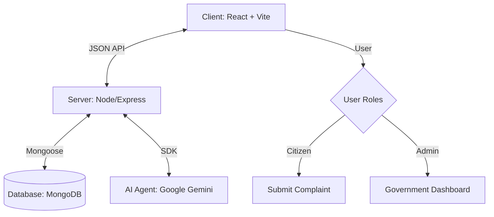

# CivicFix 🏙️✨

**CivicFix** is a next-generation "Smart City" complaint registration platform. It empowers citizens to report infrastructure issues (potholes, streetlights, garbage) and uses **Generative AI** to analyze, route, and prioritize them for the government.

---

## 🚀 Key Features
*   **AI-Powered Analysis**: Uses Google Gemini to automatically detect Category (e.g., Road, Electricity) and Priority.
*   **Emergency Bypass**: Instantly flags life-threatening reports (Fire, Gas Leak) and routes them to emergency services.
*   **Transparent Feed**: A Twitter-style public feed where citizens can upvote issues to increase visibility.
*   **Government Dashboard**: Real-time analytics and workload tracking for city officials.
*   **Visual Evidence**: Support for image uploads with location tagging.

---

## 🛠️ Technology Stack
**Core Stack (MERN)**
*   **Frontend**: React v19, Bootstrap 5, Vite
*   **Backend**: Node.js, Express.js
*   **Database**: MongoDB (Mongoose)
*   **AI**: Google Gemini 2.0 Flash

**Dependencies**
*   `axios`, `react-router-dom`, `react-bootstrap`
*   `jsonwebtoken`, `bcryptjs`, `multer` (File Uploads)

---

## 🏗️ Architecture & Workflow

### High-Level Overview


### AI Processing Flow
1.  **Citizen** submits a complaint (Text + Image).
2.  **Server** sends the description to **Google Gemini**.
3.  **Gemini** returns structured data: `{ Category, Priority, IsEmergency }`.
4.  If `IsEmergency` is true, the system triggers an immediate alert.
5.  **Database** stores the enriched complaint.

---

## 📦 Setup & Installation

### Prerequisites
*   Node.js (v14+)
*   MongoDB (Local `localhost:27017` or Atlas URI)
*   Google Gemini API Key

### 1. Configuration
Create a `.env` file in the `server/` directory:
```env
PORT=5000
MONGODB_URI=mongodb://localhost:27017/civicfix
JWT_SECRET=your_secret_key
GEMINI_API_KEY=your_google_gemini_key
```

### 2. Install Dependencies
```bash
# Install Server Dependencies
cd server
npm install

# Install Client Dependencies
cd ../client
npm install
```

### 3. Run the Application
You need two terminals:

**Terminal 1: Backend**
```bash
cd server
npm start
# Output: 🚀 Server running on port 5000 | ✅ MongoDB Connected
```

**Terminal 2: Frontend**
```bash
cd client
npm run dev
# Output: ➜ Local: http://localhost:5173/
```

Open [http://localhost:5173](http://localhost:5173) to view the app.

---

## 🧪 Seeding Mock Data
To populate the app with realistic data (Dhanbad, Jharkhand example):
```bash
cd server
node seed.js
```

---

## 📂 Directory Structure
```
civicfix/
├── client/                 # React Frontend (Vite)
│   ├── src/pages/          # Home, Feed, Dashboard, Login
│   ├── src/components/     # Navbar, ComplaintCard
├── server/                 # Express Backend
│   ├── lib/geminiAgent.js  # AI Logic
│   ├── models/             # Mongoose Schemas (User, Complaint)
│   ├── routes/             # API Routes
│   ├── uploads/            # Image Storage
└── README.md               # Project Documentation
```
